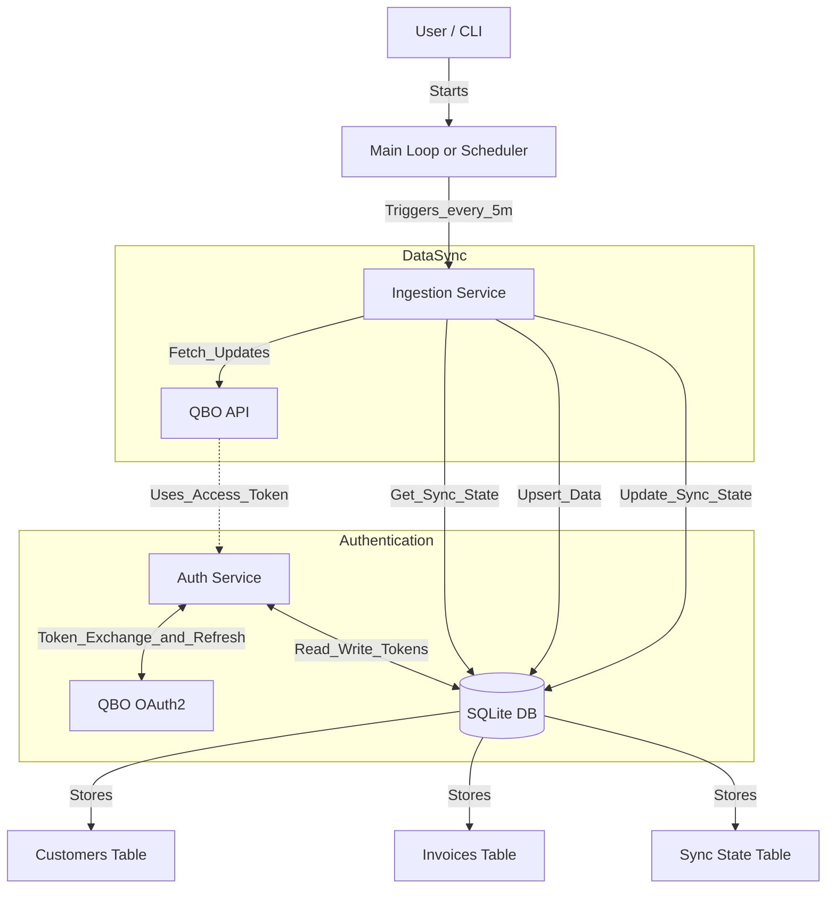

# QuickBooks Online Ingestion Service

This service ingests Customers and Invoices from QuickBooks Online (QBO) into a local SQLite database. It supports OAuth authentication, incremental syncing, and automatic token refreshing.

## Prerequisites

- Node.js (v14 or higher)
- A QuickBooks Online Developer Account
- A QBO App with `com.intuit.quickbooks.accounting` scope

## Setup

1. **Clone the repository**
   ```bash
   git clone <repository-url>
   cd ingestion-core
   ```

2. **Install dependencies**
   ```bash
   npm install
   ```

3. **Configure Environment Variables**
   Create a `.env` file in the root directory with your QBO App credentials:
   ```env
   QBO_CLIENT_ID=your_client_id
   QBO_CLIENT_SECRET=your_client_secret
   QBO_ENVIRONMENT=sandbox
   QBO_REDIRECT_URI=https://developer.intuit.com/v2/OAuth2Playground/RedirectUrl
   DB_PATH=qbo_ingestion.db
   ```
   *Note: The Redirect URI must match what is configured in your QBO App. For the OAuth Playground, use `https://developer.intuit.com/v2/OAuth2Playground/RedirectUrl`.*

## Running the Service

1. **Build and Run**
   ```bash
   npx ts-node src/index.ts
   ```

2. **First-time Authorization**
   - Go to the [Intuit OAuth Playground](https://developer.intuit.com/app/developer/playground).
   - Select your App and the `com.intuit.quickbooks.accounting` scope.
   - Click "Get Authorization Code".
   - Authorize your sandbox company.
   - Copy the **Realm ID** (Company ID - usually numeric) and **Authorization Code** (temporary OAuth code) from the playground.
   - **IMPORTANT**: These are TWO DIFFERENT values! The Realm ID is your QuickBooks Company ID, while the Authorization Code is a one-time use token from the OAuth flow.
   - Paste them into the CLI prompt when asked.

3. **Multiple Company Support**
   - The service supports authorizing multiple QuickBooks companies.
   - On startup, if you already have authorized companies, you'll see a list of existing Realm IDs.
   - You can add as many companies as needed by answering "yes" to the prompt.
   - The service will keep asking until you say "no".
   - Built-in validation prevents duplicate Realm IDs.

4. **Validation & Error Handling**
   - Empty Realm ID or Authorization Code will prompt you to retry.
   - If you enter the same value for both fields, you'll get a warning (they should be different).
   - If a Realm ID is already registered, you'll be notified and can add a different company.
   - If authorization fails, you can retry with new credentials without restarting the app.

5. **Ongoing Operation**
   - The service will perform an initial backfill of all Customers and Invoices for all authorized companies.
   - It will then poll for updates every 5 minutes for each company.
   - Tokens are automatically refreshed and stored in the database.
   - You can restart the service at any time; it will resume syncing from where it left off.

## Architecture



- **Database**: SQLite (`better-sqlite3`) is used for local storage.
  - `customers`: Stores raw Customer objects with composite primary key (realm_id, id).
  - `invoices`: Stores raw Invoice objects with composite primary key (realm_id, id).
  - `auth_tokens`: Stores OAuth tokens per Realm ID with automatic refresh.
  - `sync_state`: Tracks sync timestamps and status for each object type per realm.
- **Ingestion Logic**:
  - Uses the `LastUpdatedTime` field from QBO objects for incremental syncing.
  - Persists the raw JSON payload to ensure no data loss.
  - Handles pagination (1000 records per page) and API errors.
  - Uses upsert pattern (INSERT ... ON CONFLICT DO UPDATE) for idempotent data updates.
- **Resilience**:
  - Sync state is updated only after successful persistence.
  - Failures are logged with error messages in sync_state table.
  - The service retries on the next cycle using the last successful checkpoint.
  - Token expiration is handled automatically with refresh tokens.
  - All database operations use CHECK constraints to prevent invalid data.

### Database Schema Details

**sync_state table**:
- `realm_id` (TEXT): QuickBooks Company ID
- `object_type` (TEXT): Either 'Customer' or 'Invoice'
- `last_successful_sync` (INTEGER): Unix timestamp of the last successful data sync - used as the checkpoint for incremental queries
- `last_sync_attempt` (INTEGER): Unix timestamp of the last sync attempt - used for monitoring
- `status` (TEXT): Either 'success' or 'failure'
- `error_message` (TEXT): Error details if status is 'failure'

**Important**: The service uses Unix epoch timestamps (seconds) internally but converts to ISO 8601 format when making QuickBooks API calls.

**Sync State Logic**:
- On success: Both `last_successful_sync` and `last_sync_attempt` are updated. The checkpoint advances to ensure we don't re-query the same data.
- On failure: Only `last_sync_attempt` is updated. The checkpoint (`last_successful_sync`) is preserved so the next sync retries from the same point.

## Helper Scripts

The project includes utility scripts to help manage the database:

### clear-auth.js
Removes all authorization tokens from the database.

```bash
node clear-auth.js
```

Use this when you want to re-authorize all companies from scratch.

### remove-realm.js
Removes a specific Realm ID and all associated data (customers, invoices, sync state).

```bash
node remove-realm.js
```

This script will:
1. Display all currently authorized companies
2. Prompt you to enter the Realm ID to remove
3. Delete all data associated with that company

Use this when:
- You need to re-authorize a specific company (e.g., after token revocation)
- You want to remove a company from the sync pool

### truncate-all.js
Clears ALL data from all tables while preserving the schema.

```bash
node truncate-all.js
```

**WARNING**: This deletes:
- All authorized companies
- All customers
- All invoices
- All sync state

Use this for a complete fresh start. You'll need to re-authorize all companies.

## Troubleshooting

### Common Errors

#### Error: "Token revoked" (QBO error code 3200)
**Cause**: The authorization code has already been used or the tokens were manually revoked.

**Solution**:
1. Run `node remove-realm.js` and remove the affected Realm ID
2. Get a fresh authorization code from the OAuth Playground
3. Restart the application and re-authorize the company

**Note**: Authorization codes are single-use only. You must get a new code each time you authorize.

#### Error: "Invalid date" or "Value should be a valid date value" (QBO error code 2070)
**Cause**: QuickBooks API received an incorrectly formatted timestamp.

**Solution**: This should be handled automatically by the service (converts Unix timestamps to ISO 8601 format). If you see this error, check that the `qbo.ts` file has the timestamp conversion logic:

```typescript
if (lastSyncTime) {
  const date = new Date(lastSyncTime * 1000); // Convert to milliseconds
  const isoDate = date.toISOString();
  query += ` WHERE MetaData.LastUpdatedTime > '${isoDate}'`;
}
```

#### Error: "table sync_state has no column named last_sync_attempt"
**Cause**: You have an old database file with the previous schema.

**Solution**:
1. Run `node truncate-all.js` to clear the old data, OR
2. Delete the `qbo_ingestion.db` file manually
3. Restart the application to create the new schema

#### Realm ID and Authorization Code confusion
**Symptom**: Authorization fails or you accidentally enter the same value for both.

**Clarification**:
- **Realm ID**: Your QuickBooks Company ID (found in the OAuth Playground URL after authorization, usually numeric like "123456789")
- **Authorization Code**: The temporary OAuth code from the redirect URL (long alphanumeric string that expires quickly)

The service will warn you if both values are identical.

## Future Improvements

- **Web Interface**: Add a simple UI to view sync status and manage connections.
- **Webhooks**: Implement QBO Webhooks for real-time updates instead of polling.
- **Multiple Entities**: Expand support to other QBO objects (Payments, Items, etc.).
- **Better Error Handling**: Implement exponential backoff for API rate limits.

### GUI Tools

#### DBeaver
1.  **Open DBeaver**.
2.  Click on **"New Database Connection"** (plug icon) or go to **Database > New Database Connection**.
3.  Select **SQLite** and click **Next**.
4.  In the **"Path"** field, click **"Browse"** and navigate to the project folder.
5.  Select the `qbo_ingestion.db` file.
6.  Click **Finish**.
7.  In the **Database Navigator**, expand the connection -> **Tables** to view `customers`, `invoices`, etc.

#### Other Tools
- **DB Browser for SQLite**: A high-quality, visual, open source tool.
- **VS Code Extensions**: Extensions like "SQLite" or "SQLite Viewer".
